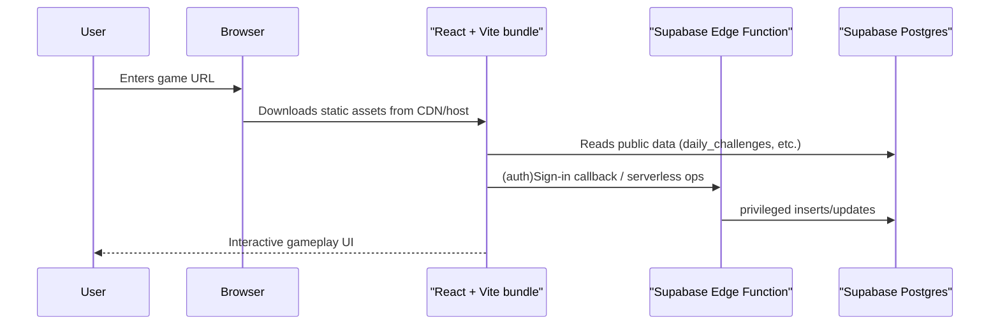

# 03 – Architecture Overview

This document explains **how the pieces of the Brawl-Stars-Guess application fit
together**—from the browser all the way to Supabase's Postgres database.

Reading time: < 10 min.

---

## 1. High-level diagram

> The React bundle is fully static; all dynamic behaviour happens client-side or
> via Supabase HTTP calls.

---

## 2. Front-end (React)

* **Framework**: React 18 with TypeScript, bundled by **Vite** (SWC transform).
* **Routing**: React Router v6 (`BrowserRouter`) – page components live in
  `src/pages/*`.
* **State**:
  * **tanstack/react-query** – caching & server-state synchronisation.
  * **Zustand** – lightweight global stores (e.g., streak counters).
  * **React Context** – Language, Auth modal, etc.
* **Styling**: Tailwind CSS + shadcn-ui component primitives.
* **Auth flow**: Supabase auth (PKCE) handled entirely from the browser. The
  callback route `/auth/callback` finalises the session.
* **Build targets**: modern evergreen browsers; legacy polyfills are not
  included (check compatibility before adding one).

### File entrypoints

| Purpose              | Path                          |
| -------------------- | ----------------------------- |
| Vite HTML template   | `index.html`                  |
| React root           | `src/main.tsx`                |
| App component & router| `src/App.tsx`                |

---

## 3. Back-end (Supabase)

Supabase provides **Postgres**, **Row-level security**, **Auth**, and
**serverless edge functions**.

### Database tables (public schema)

| Table            | Purpose                       |
| ---------------- | ----------------------------- |
| `daily_challenges` | Stores JSON "seed" for each day & mode |
| `profiles`         | User profile & streak data   |
| *(default auth tables)* | Managed by Supabase      |

*(See `integrations/supabase/types.ts` for exact generated typings.)*

### Edge functions

| Folder                                   | Description                                |
| ---------------------------------------- | ------------------------------------------ |
| `supabase/functions/generate-daily-challenges` | Generates daily challenge rows; called by cron |
| `supabase/functions/cron-setup`          | One-shot function that schedules the above via `pg_cron` |

Both functions are written in Deno, use `@supabase/supabase-js` v2, and require
`SUPABASE_SERVICE_ROLE_KEY` at runtime. In the hosted Supabase environment
these env vars are injected automatically.

### Scheduled job flow

1. `cron-setup` RPC enables extensions and schedules a midnight (UTC+2) call
   to `generate-daily-challenges` every day.
2. The generator function checks whether rows already exist for *today* and
   inserts new challenges only if needed.

This keeps the front-end completely stateless—the browser simply fetches the
current day's challenge from the `daily_challenges` table.

---

## 4. Data flow (runtime)

1. **App load** – React bundle initialises language & auth, prefetches current
   streak via `react-query`.
2. **Daily mode** – On a daily route (`/daily/classic`, etc.) the page selects
   the day's entry from Supabase. That payload defines correct answers for the
   guess logic.
3. **Guess interaction** – Component state lives in local React hooks; global
   result trackers reside in Zustand stores.
4. **Score submission** – (Future) results can be posted back to Supabase to
   build leaderboards.

---

## 5. Hosting & deployment (tl;dr)

* **Front-end** – Static files in `dist/` can be uploaded to any CDN (Vercel,
  Netlify, Firebase Hosting, Cloudflare Pages). See `06-build-and-deployment.md`.
* **Back-end** – Supabase project `zkqlqveltfxvelxzyyik`. Edge functions live in
  the **Functions** tab and are deployed via the Supabase CLI or GitHub Actions.

---

## 6. Extending the architecture

* **New serverless logic** → add a folder under `supabase/functions/` and deploy
  via `supabase functions deploy <name>`.
* **Additional state slices** → colocate Zustand stores in `src/stores/`.
* **Heavy computations** → prefer edge functions; keep the React bundle thin.

If your change affects multiple layers, document the rationale under
`17-key-design-decisions.md`. 