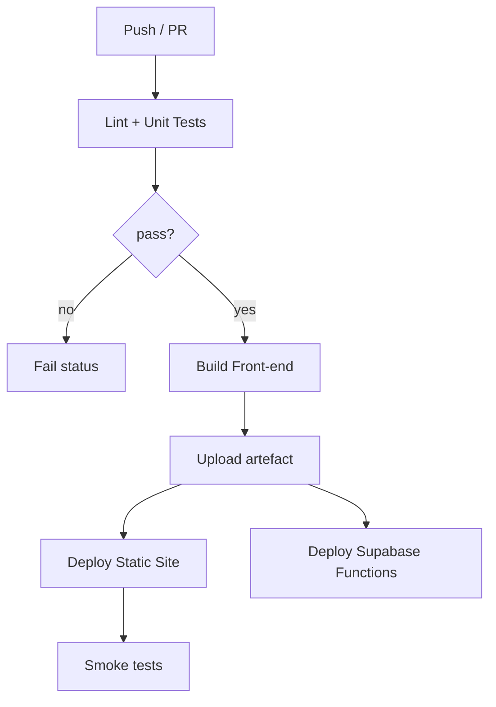

# 13 – CI / CD Pipeline

This document specifies the continuous-integration and continuous-deployment
strategy for Brawl-Stars-Guess.  Even if you run the workflow manually, keeping
these steps documented ensures any future GitHub Actions (or other provider)
will behave exactly as expected.

> Status: *partially implemented*.  The sample YAML below is production-ready
> but not yet committed to `.github/workflows/`.  Add it when you're ready to
> automate.

---

## 1. Goals

1. ✅ **Prevent broken code from reaching `main`.**
2. ✅ **Produce an artefact** (`dist/` + Edge Function bundles) on every merge.
3. ✅ **Deploy automatically** to the chosen static host & Supabase.
4. 🟡 **Run smoke/E2E tests** after deploy (future enhancement).

---

## 2. Pipeline overview



---

## 3. GitHub Actions workflow

Save as `.github/workflows/ci.yml`.

```yaml
name: CI / CD

on:
  push:
    branches: [ main ]
  pull_request:
    branches: [ main ]

jobs:
  build:
    runs-on: ubuntu-latest
    permissions:
      contents: read
      deployments: write

    steps:
      - uses: actions/checkout@v4

      - name: Install Bun
        uses: oven-sh/setup-bun@v1
        with:
          bun-version: latest

      - name: Install dependencies (cached)
        run: |
          bun install

      - name: Lint
        run: bun run lint

      - name: Unit tests
        run: bun run test

      - name: Build front-end
        run: bun run build

      - name: Upload artefact
        uses: actions/upload-artifact@v4
        with:
          name: dist
          path: dist/

  deploy:
    needs: build
    if: github.ref == 'refs/heads/main' && github.event_name == 'push'
    runs-on: ubuntu-latest

    steps:
      - uses: actions/download-artifact@v4
        with:
          name: dist
          path: dist

      # Example: Deploy to Vercel (change to your provider)
      - name: Deploy to Vercel
        uses: amondnet/vercel-action@v25
        with:
          vercel-token: ${{ secrets.VERCEL_TOKEN }}
          vercel-org-id: ${{ secrets.VERCEL_ORG_ID }}
          vercel-project-id: ${{ secrets.VERCEL_PROJECT_ID }}
          working-directory: dist
          prod: true

      # Deploy Supabase Edge Functions (only if functions folder changed)
      - name: Deploy Supabase Functions
        if: |
          contains(github.event.head_commit.message, 'supabase/functions') ||
          contains(github.event.head_commit.message, 'Edge Functions')
        env:
          SUPABASE_ACCESS_TOKEN: ${{ secrets.SUPABASE_ACCESS_TOKEN }}
        run: |
          bunx supabase functions deploy generate-daily-challenges --project-id zkqlqveltfxvelxzyyik
          bunx supabase functions deploy cron-setup --project-id zkqlqveltfxvelxzyyik
```

### Secrets required

| Secret name              | Used for                       |
| ------------------------ | ------------------------------ |
| `VERCEL_TOKEN`           | Auth token for Vercel API      |
| `VERCEL_ORG_ID`          | Vercel org                     |
| `VERCEL_PROJECT_ID`      | Vercel project                 |
| `SUPABASE_ACCESS_TOKEN`  | Personal access token from Supabase (role: *owner*) |

Adjust the deploy step only if you migrate away from Vercel.

---

## 4. Branch protection

Enable the following rules in GitHub settings:

* Require status checks **Lint**, **Unit tests**, **Build front-end** to pass.
* Require PR review before merge.
* Enforce linear history (squash-merge only).

---

## 5. Future improvements

1. **Playwright smoke tests** hitting the deployed URL and checking:
   * Index page loads (`200 OK`).
   * Daily Classic Mode answer input renders.
2. **Cache Bun dependencies** using `actions/cache` (keyed by bun.lockb hash).
3. **Automatic release notes** generated from Conventional Commits (see
   `23-release-notes-template.md`).
4. **Visual Regression Tests** with Chromatic or Percy on Storybook (once
   component library is externalised).

---

A reliable CI/CD pipeline is critical for fast iteration—copy the sample YAML,
add the listed secrets, and you'll have zero-click deployments from `main`.  If
you change hosts or add stages, update this document **and** the workflow file
in the same PR. 